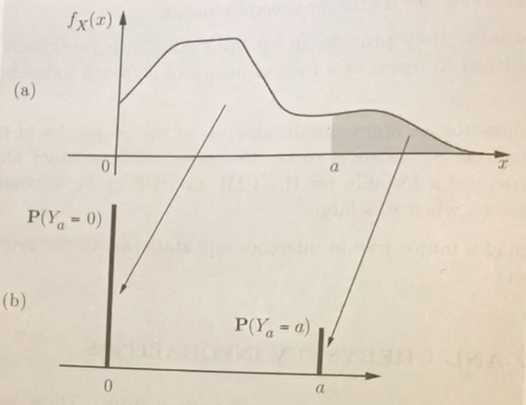

# The Fundamentals of Probability

## Continuous Random Variables

#### Functions of Random Variables

#### Functions of Random Variables: The Moment Generating Function

$$M_X(s) = E[e^{sX}]$$

Taylor series expansion of the MGF:

$$E[e^{sX}] = 1 + sE[X] + \ldots + \frac{s^n}{n!}E[X^n] + \ldots$$

The moment generating function of $X$ is useful because it makes it easier to find moments, deal with sums of random variables (no more convolution!), and prove "hard" things. 

Observe that by taking the $n_{th}$ derivative of $M_X(s)$ with respect to $s$ and setting s to 0, we get the $n^th$ moment of $X$.

$$\frac{d^n}{ds}M_X(s) = E[X^n]$$

Properties

- $M_X(0) = 1$


- If $Y = aX + b$, $M_Y(s) = e^{sb}M_X(sa)$


- Let $Z = X + Y$, $M_Z(s) = M_Y(s)M_X(s)$

<font color="red">common MGF formats</font>

*(e.g.) MGF of Pois($\lambda$)*

$$M_X(s) = E[e^{sX}] = \sum_{n = 0}^\infty e^{sn}\frac{\lambda^n}{n!}e^{-\lambda} = e^{-\lambda}\sum_{n = 0}^\infty \frac{(e\lambda)^n}{n!} = e^{\lambda(e^s - 1)}$$

*(e.g.) Poisson Merging.*

Let $X \sim Pois(\lambda)$ and $Y \sim Pois(\mu)$. Find $Z = X + Y$.

$$M_Z(s) = M_X(s)M_y(s) = e^{\lambda(e^s - 1)}e^{\mu(e^s - 1)} = e^{(\lambda + \mu)(e^s - 1)}$$

$$Z \sim Pois(\lambda + \mu)$$

Note: we were able to find the distribution(!) for variable Z by finding the distribution of its MGF and reformulating it into a recognizable pattern. We can do this because the MGF for a random variable of a certain distribution is unique.

*(e.g.) Poisson Splitting.*

You are looking for a book in a bookstore, which has the book with probability $p$. You spend an exponential amount of time in each book store. What is the total time you spend in bookstores?

This is a random number of random variables, so use the law of iterated expectation. Let your total time be $T = \sum_{i = 1}^n X_n$. Note that $N \sim Geom(p)$.

$$E_N[M_{T|N}(s)] = E_N[(M_X(s))^N]$$

By math and some pattern matching: $M_N(s) = \frac{p\lambda}{s - p\lambda} \rightarrow T \sim Exp(p\lambda)$

#### Order Statistics

Let X be a CRV for which $X_1, ..., X_n$ are vales of a random, independent sampling of size $N$ and reorder from smallest to largest:

$$X^{(1)} \leq X^{(2)} \leq \ldots \leq X^{(n)}$$

If $X \sim f_X(x)$, then $X^{(i)}$ has pdf:

$$f_{X^{(i)}}(y) = \frac{n!}{(i - 1)!(n - i)!}(F_{x}(y))^{(i - 1)}[1 - F_X(y)]^{(n - i)}f_X(y)$$

The probability that the $i_{th}$ smallest sample falls in an infinitesimal interval about x is equal to the number of ways to order n elements into sets of size 1, i - 1, and n - i times the probability that we get i - 1 values below y, n - i above y, and one "at" y. Note that ${n \choose i - 1, 1, n - i} = \frac{n!}{(i - 1)!(n - i)!}$.

## Expectation

#### Law of Iterated Expectation 
$$E[X] = E_Y[E_X[E[X|Y]]] = \sum_{$y \in Y$}\Pr(Y = y)E[X|Y = y]$$

*(e.g.) Sum of a Random Number of independent RVs*

Let $Y = \sum_{i = 1}^N X_i$ and $N \sim (0, 1)$.

$$E[Y] = E_N[E[Y|N]] = E_N[NE[X_i]] = E[N]E[X_i]$$

*(e. g.) Expectation of n coin tosses with random probability of heads.*

We toss a coin $n$ times. $\Pr(\text{heads}) \sim U[0, 1]$. Find the expectation of the total number of heads.

$$E[X] = E[E[X|Y]] = E[NH] = NE[H] = \frac n2$$

#### The Conditional Expectation as an Estimator

The expectation of $X$ given $Y$ is (1) an unbiased estimator and (2) uncorrelated with estimation error. We use (2) to prove the law of total variance.

$$\hat{X} = E[X|Y]$$

$$\tilde{X} = \hat{X} - X$$

$$E[\tilde{X}] = 0 \text{ and } cov(\hat{X}, \tilde{X}) = 0$$

We could also interpret our estimator as minimizing projection onto a subspace.
<font color="red">more</font>

## Variance

#### Law of Total Variance

$$Var(X) = Var(E[X|Y]) + E[Var(X|Y)]$$

The variance of a random variable is equal to the variance of the average within each class plus the average class variance.

*(e. g.) Variance of n coin tosses with random probability of heads.*

We toss a coin $n$ times. $\Pr(\text{heads}) \sim U[0, 1]$. Find the variance of the total number of heads.

$$Var(X) = E_H[Var(X|H)] + Var_H(E[X|H]) = E_H[nH(1 - H)] + Var_H(nH) = \frac{n^2}{12} + \frac n6$$


## Bounds: Limiting Behavior of Random Variables

#### Markov Inequality

If a random variable X can only take on nonnegative values, then




$$E[X] \geq a\Pr(X\geq a)$$

$$\Pr(X\geq a)\leq \frac{E[X]}{a}$$

If $g(\cdot)$ is a non-decreasing and non-negative function of $X$:

$$P[g(X) > g(a)]\leq \frac{E[g(X)]}{g(a)}$$

#### Chebyshev Inequality

If X is a random variable with finite mean and variance $\sigma^2$, 

$$P[|X - \mu|>c]\leq\frac{Var(X)}{c^2}, \forall c > 0$$

Chebyshev's helps us find the "deviations" from average. If a random variable has small variance, the probability that X takes on a value far from the mean is small.

#### Chernoff Bound

Pick a function of X such that we get its MGF when evaluating the Markov Inequality: $Y = e^{sX}$

$$P(X > a) \leq \min_{s > 0}(e^{-sa}M_X(s))$$

Recall that the MGF of X captures the entire distribution of X, so we expect it to be more powerful. The Chernoff bound will give us exponential bounds in a, which will allow us to make stronger claims as a scales.

## Convergence

#### Convergence in Distribution

If $X_n \rightarrow X$, then $\Pr(X_n\leq x) \rightarrow \Pr(X\leq x)$.

#### Convergence in Probability

$$\forall \epsilon > 0, \lim_{n\rightarrow\infty}P(|X_n - x| \geq \epsilon)= 0$$

#### Convergence Almost Surely (with Probability 1)

$$\lim_{n\rightarrow\infty}\Pr(X_n = x) = 1$$

When reasoning about convergence with probability 1, consider the number of arrivals such that $X_n \neq x$. If this is finite, then $X_n$ converges to $x$ almost surely.

*(e.g.) Arrivals in Increasing Interval Lengths*

Time is discrete and there is one arrival in each interval of $I_k$:

$$I_k = \{2^k, 2^{k} + 1, \ldots, 2^{k+1}-1\}$$

The length of $I_k$ is $2^k$. The probability of an arrival at time $Y_n$ converges to zero in probability:

$$\lim_{n\rightarrow\infty}\Pr(Y_n = 0) = \lim_{k\rightarrow\infty}\frac 1{2^k}=0$$

Yet there at any time, there are still an infinite number of arrivals. So $Y_n$ does not converge to $0$ almost surely.

## Law of Large Numbers

#### Weak Law of Large Numbers

The sample mean is close to the actual mean with high probability because the variance decreases linearly with $n$. To prove this formally, apply Chebyshev's. Let $X_1, \ldots, X_n$ be i.i.d. RVs with mean $\mu$. $M_n$ is their mean. For every $\epsilon \geq 0$.

$$P(|M_n - \mu|\geq \epsilon) \rightarrow 0$$

This is an example of convergence in probability.

#### Strong Law of Large Numbers

The sample average equals the average with probability $p$.

$$\Pr\left(\lim_{n\rightarrow\infty}\frac{X_1 + \ldots + X_n}{n} = \mu\right)=1$$

#### Capacity of the Binary Erasure Channel

We'll use the law of large numbers to show that we can achieve a capacity of $1 - p$ in a binary erasure channel (BEC), even without feedback.

Let $n$ be the number of bits we transmit and $L$ be the number of possible messages. Our rate is $R = \frac{logL}n$ bits per channel use.

Solution: Create an L x n code book by randomly flipping coins. The code at row $i$ defines message $i$. Once we transmit this message over the channel, we expect to receive $n(1-p)$ bits. The receiver looks up the message in a truncated code book with $n(1-p)$ columns. The message is successfully received if the code word uniquely defines one message.

$$\Pr(\text{failure}) = \Pr(\text{there exists}\geq\text{2 entries which match received code word})$$
$$\Pr(\text{failure}) \leq L\left(\frac 12\right)^{\frac n2} = 2^{n(R - \frac 12)} \rightarrow 0$$

## Central Limit Theorem

The law of large numbers tells us that the variance of the sample mean decreases with $n$, but what can be said of the sample sum? The CLT scales the sample sum by to keep variance constant and asserts that the distribution of a scaled and shifted sample sum approaches the standard normal: $Z_n \sim N(0, 1)$. Let $X_i$ be i.i.d with mean $\mu$ and $S_n = \sum_{i = 1}^n X_i$:

$$Z_n = \frac{S_n - n\mu}{\sigma\sqrt{n}}$$

$$\lim_{n\rightarrow\infty}\Pr(Z_n \leq z) = \phi(x) = \frac{1}{2\pi}\int_{-\infty}^{x}e^{\frac{-x^2}{2}}$$

Alternate view: Consider the convolution of $n$ i.i.d RVs. Shape becomes more normal but spread approaches, so normalize by dividing by $\sigma\sqrt{n}$

$$S_n\rightarrow N(n\mu, \sigma^2n)$$
$$M_n\rightarrow N(\mu, \sigma^2n)$$

Implication
- the distribution of $S_n$ and $M_n$ wipe out all information about $X_i$ excpet for $\mu$
- if there are a large number of independent factors that are aggragated, then there overall effect will be normally distributed


```python

```
